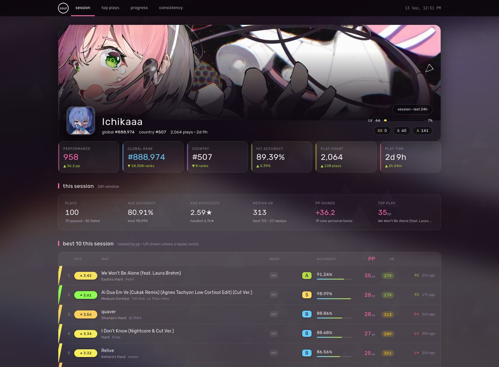
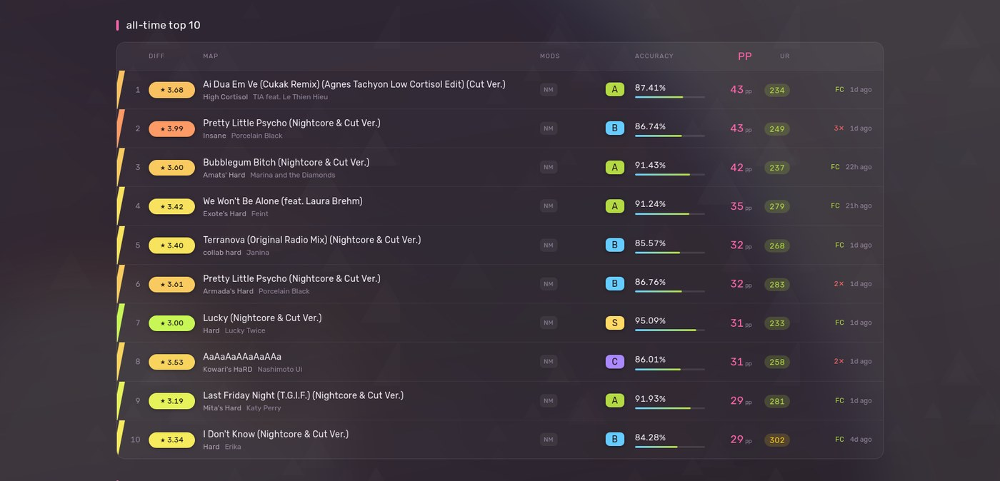
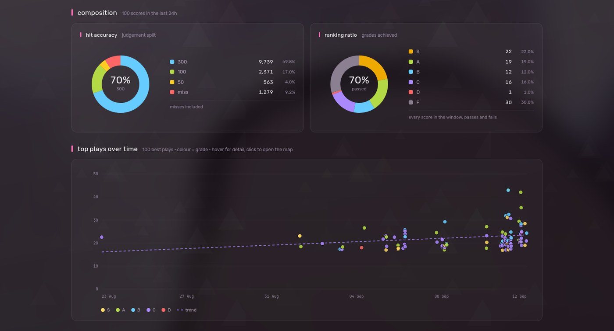
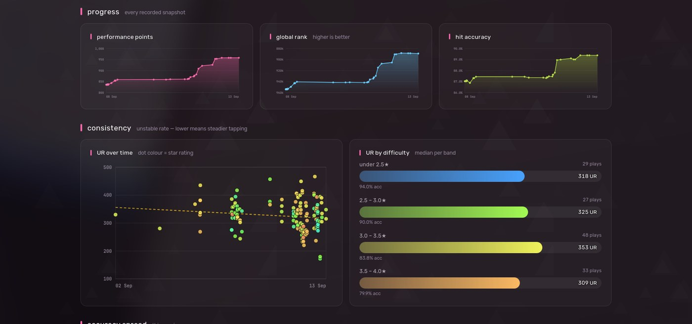
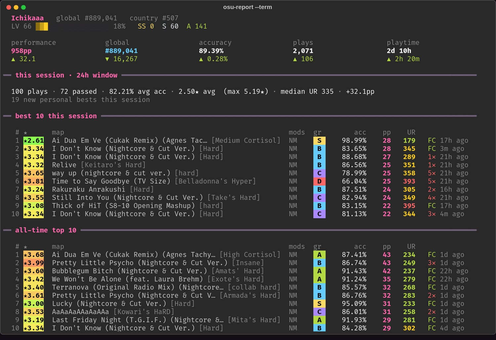
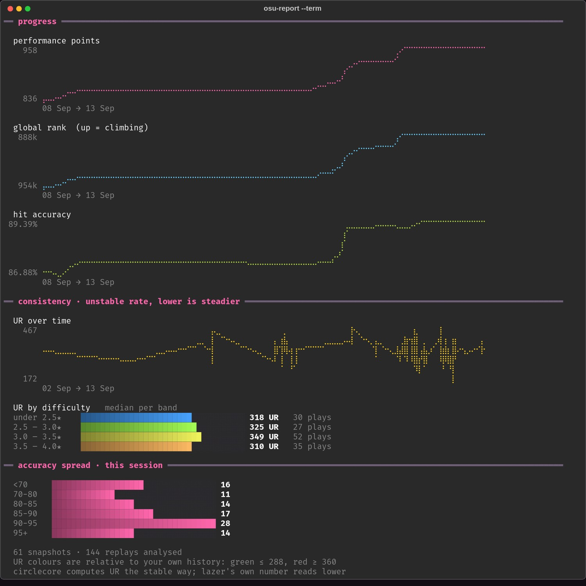

# Screenshots

[← back to README](../README.md)

## The dashboard

Takes its colour from your profile banner.



## Top plays

Every row links to its map. UR shown wherever a replay exists.



## Composition and history

Rings break down the session's judgements and grades. The scatter plots all 100
of your top plays — when you set them against what they were worth. Hovering
locks a crosshair to the nearest point and lifts its whole grade series.



## Progress and consistency

Progress curves for pp, rank and accuracy. Unstable rate over time, coloured by
star rating, and median UR per difficulty band.



## In the terminal

```bash
osu-report --term
```



Charts are drawn in braille — 2×4 dots per character cell, eight times the
resolution of block sparklines.

Works in any terminal with 24-bit colour and a font carrying braille: kitty,
alacritty, ghostty, foot, wezterm, Windows Terminal.

`--image` draws the full graphical report inline instead. chafa picks whatever
image protocol your terminal speaks — the kitty protocol in kitty and ghostty,
sixels in foot and wezterm — and falls back to block art where there's none.


